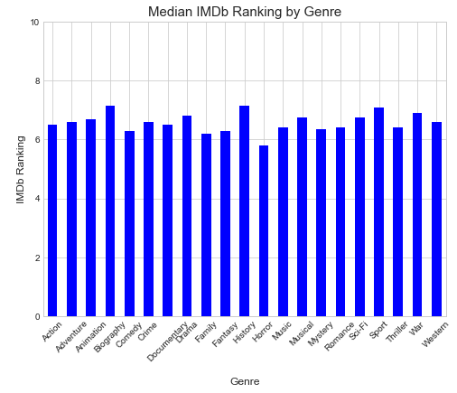
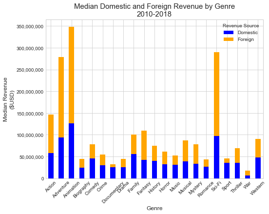
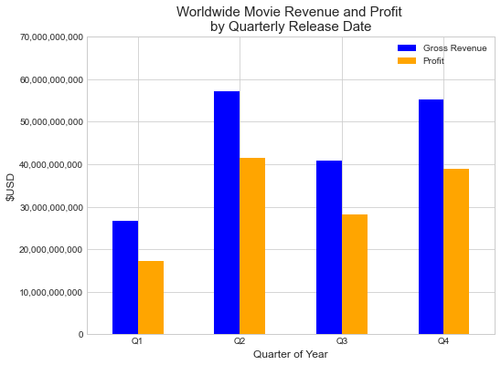
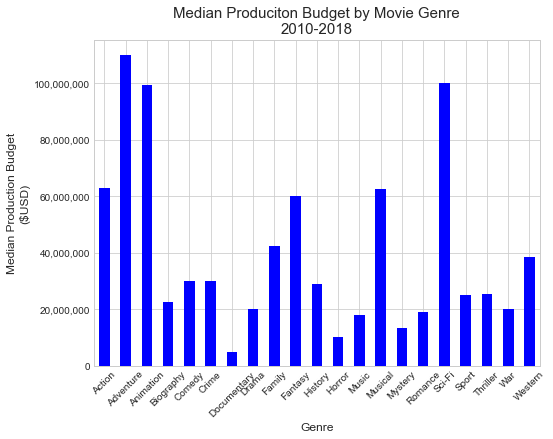

# Microsoft Movie Studio New Movie Production Recommendation
       
## Overview

## Objective - Business Problem
Microsoft is creating a new movie studio and wants to know what types of movies they should create. This project will explore what types of movies are currently doing the best at the box office and recommend what types of movies Microsoft should create.

* What movie genres should Microsoft Movie Stuios focus on?
* When should these movies be released?
* How much should be budgeted for produciton of each movie?

## Deliverables
* [Presentation:  Genre, Release Time, and Budget for Microsoft Movie Studio](https://docs.google.com/presentation/d/1FRCtFUkY__pndP7pPa4Z1vMWZ-83tGATsAjRPp5Ye9U/edit?usp=sharing)
* Jupyter Notebook
* GitHub Repository

## Repository Navigation
* [/img](./img) - contains image files
* [/img/fig](./img/fig) - stores plots and figures created with the analysis
* [/zippedData](./zippedData) - stores data used for this analysis
* [/license](./license) - contains the license information
* [project_notebook.ipynb](project_notebook.ipynb) - Jupyter Notebook 

## Technologies
* [Python](https://www.python.org/)
* [pandas](https://pandas.pydata.org/) library
* [matplotlib](https://matplotlib.org/) library
* [sqlite3](https://docs.python.org/3/library/sqlite3.html) library

## Methods
1. Clone this repo (for help see this [tutorial](https://help.github.com/articles/cloning-a-repository/)).
2. Raw data is sttored [here](../zippedData)
	* Import necessary data
3. Exploratory Data Analysis
	* 
4. Plot visualizations

### The Data

#### Data Description

In the folder `zippedData` are movie datasets from:

* `bom.movie_gross.csv.gz`: [Box Office Mojo](https://www.boxofficemojo.com/)
	* stored in compressed CSV
	* contains domestic and foreign gross revenue
* `tn.movie_budget.csv.gz`: [The Numbers](https://www.the-numbers.com/)
	* stored in compressed cSV
	* contains production budget

Box Office Mojo and The Numbers data are stored in compressed CSV (comma-separated values).

* `im.db.zip`: [IMDB](https://www.imdb.com/)
	* stored in a SQLite database
	* contains user generated rankings on a scale of 0 - 10 with 0 being the worse and 10 the best

## Data Analysis and Recommendations

### Movie genre does not have an effect on IMDb 
* More profitable movies do not on average much difference in user ranking

###  Movie genre should be a combination of Action, Adventure, Animation, or Sci-Fi
* Generate the most worldwide gross revenue

###  The movie should be released in Q2 or Q4
* Q2 and Q4 have the highest revenue

###  Expect to budget between $100 million per movie
* The highest revenue generators also have the highest production budgets

## Conclusions
* Summary of conclusions including three relevant findings

